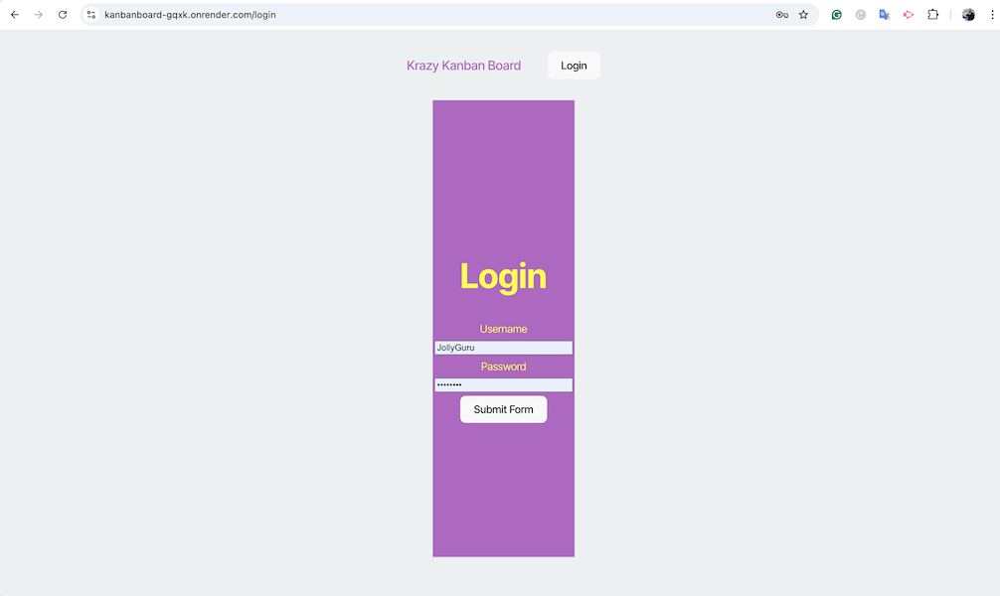
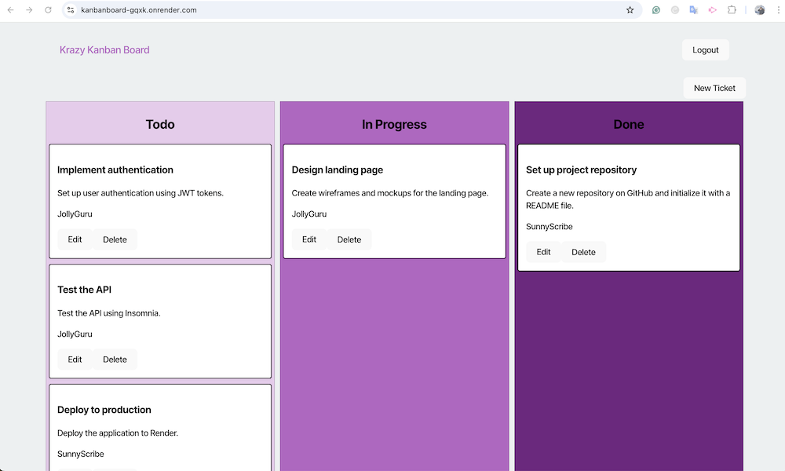

# Krazy Kanban Board

A Kanban-style task management system developed as part of Challenge 14 of the Bootcamp, using a Full-Stack stack (React, Node.js, Express, and PostgreSQL).

## 🚀 Features

- **JWT Authentication**: Secure login system and protected routes.
- **Ticket Management**: Create, update, move, and delete tickets.
- **User-friendly Interface**: Column-based Kanban board visualization (To-Do, In Progress, Done).
- **REST API**: Backend developed with Express.js and PostgreSQL database.
- **Deployment**: Deployed on Render with environment variables configured.

## 📂 Project Structure

### Backend
- **Node.js** with Express.
- **Sequelize** as ORM for PostgreSQL.
- **Protected Routes** using JWT.

### Frontend
- **React.js** with functional components.
- **Bootstrap** for styling the application.
- **Dynamic interactions** with the backend.

## 🛠️ Usage

### Main Endpoints

- **`POST /auth/login`**: Log in and get a token.
- **`GET /api/tickets`**: Get all tickets (requires token).
- **`POST /api/tickets`**: Create a new ticket.
- **`PUT /api/tickets/:id`**: Update a ticket.
- **`DELETE /api/tickets/:id`**: Delete a ticket.

##  Deployment

The app is deployed on Render:
- **Deployed App**: [https://kanbanboard-gqxk.onrender.com](#)

##  Screenshots

